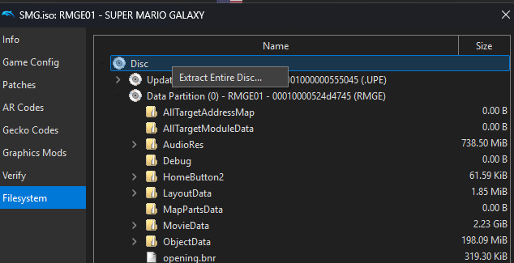
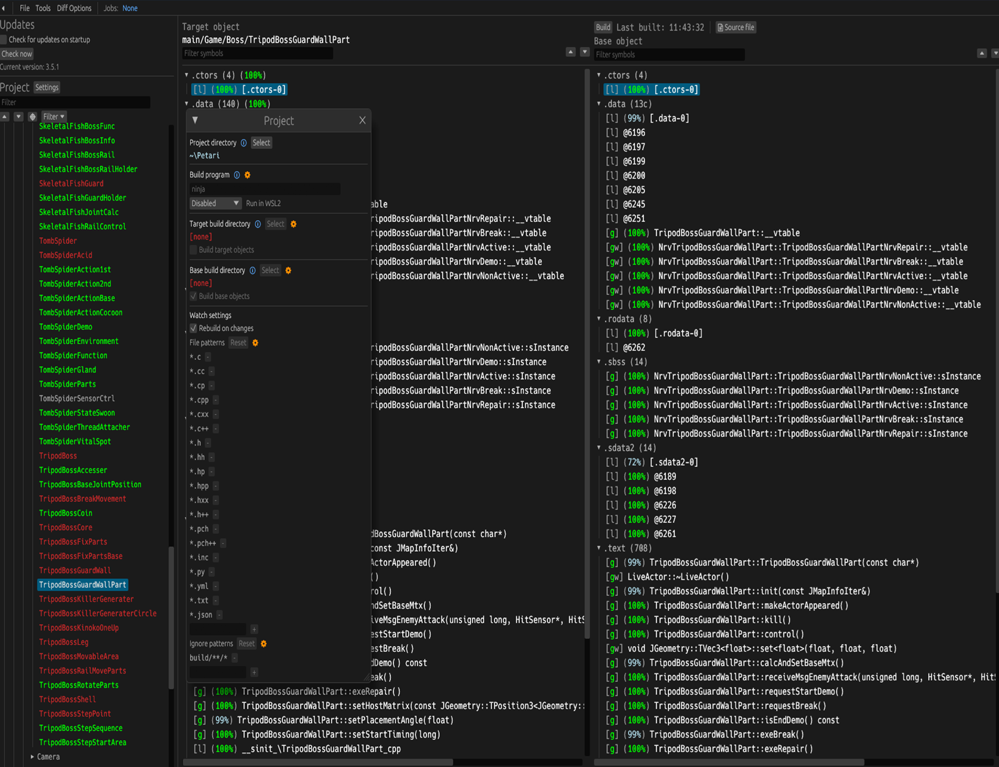

Petari
[![Build Status]][actions] ![RMGJ01_Code]![RMGJ01_Link] ![RMGE01_Code]![RMGE01_Link] ![RMGK01_Code]![RMGK01_Link] [![Discord Badge]][discord]
=============

[Build Status]: https://github.com/SMGCommunity/Petari/actions/workflows/build.yml/badge.svg
[actions]: https://github.com/SMGCommunity/Petari/actions/workflows/build.yml

[RMGJ01_Code]: https://decomp.dev/SMGCommunity/Petari/RMGJ01.svg?mode=shield&measure=code&label=RMGJ01
[RMGJ01_Link]: https://decomp.dev/SMGCommunity/Petari/RMGJ01.svg?mode=shield&measure=complete_code_percent&label=
[RMGE01_Code]: https://decomp.dev/SMGCommunity/Petari/RMGE01.svg?mode=shield&measure=code&label=RMGE01
[RMGE01_Link]: https://decomp.dev/SMGCommunity/Petari/RMGE01.svg?mode=shield&measure=complete_code_percent&label=
[RMGK01_Code]: https://decomp.dev/SMGCommunity/Petari/RMGK01.svg?mode=shield&measure=code&label=RMGK01
[RMGK01_Link]: https://decomp.dev/SMGCommunity/Petari/RMGK01.svg?mode=shield&measure=complete_code_percent&label=

[Discord Badge]: https://img.shields.io/discord/727908905392275526?color=%237289DA&logo=discord&logoColor=%23FFFFFF
[discord]: https://discord.gg/ZxEqyYeZbf
[progress_link]: https://decomp.dev/SMGCommunity/Petari

<!-- markdownlint-disable MD033 -->
[][progress_link]
<!-- markdownlint-enable MD033 -->

A work-in-progress decompilation of Super Mario Galaxy.

This repository does **not** contain any game assets or assembly whatsoever. An existing copy of the game is required.

This project is **not** meant to be an effort to create a PC port. Join the Discord server to learn more and ask about our work-in-progress PC port "AstroCore".

## Regarding AI Usage

A lot of discussion and accusations have been made claiming we used AI/LLMs to accelerate the decompilation process. **We did not**.

Although AI was allowed for tasks that did not directly affect progress, such as variable naming, code cleanup, and documentation, **it never ended up playing a role in this project**. The fast progress acceleration of the project was a result of **new collaborators**, a ton of **motivation**, and **great community efforts**. It was not a result of AI usage or any other kind of automated decompilation work.

If you don't trust this statement enough, read the source code yourself and form your own conclusions.

Below are our AI usage guidelines:

> [!NOTE]
> AI may be used for code cleanup, formatting, documentation, and naming assistance. AI-generated decompilation work is not allowed. Pull requests containing obvious AI-generated decompilation output or other AI slop will be rejected. Contributors should be able to explain and justify any decompilation work they submit. This also applies to all tool-generated code. We want to keep this project as human as possible.

Supported versions:

- `RMGJ01` (Japan)
- `RMGE01` (North America)
- `RMGK01` (Korea)

Dependencies
============

Windows
--------

On Windows, it's **highly recommended** to use native tooling. WSL or msys2 are **not** required.  
When running under WSL, [objdiff](#diffing) is unable to get filesystem notifications for automatic rebuilds.

- Install [Python](https://www.python.org/downloads/) and add it to `%PATH%`.
  - Also available from the [Windows Store](https://apps.microsoft.com/store/detail/python-311/9NRWMJP3717K).
- Download [ninja](https://github.com/ninja-build/ninja/releases) and add it to `%PATH%`.
  - Quick install via pip: `pip install ninja`

macOS
------

- Install [ninja](https://github.com/ninja-build/ninja/releases):

  ```sh
  brew install ninja
  ```

[wibo](https://github.com/decompals/wibo), a minimal 32-bit Windows binary wrapper, will be automatically downloaded and used.

Linux
------

- Install [ninja](https://github.com/ninja-build/ninja/releases).

[wibo](https://github.com/decompals/wibo), a minimal 32-bit Windows binary wrapper, will be automatically downloaded and used.

Building
========

- Clone the repository:

  ```sh
  git clone https://github.com/SMGCommunity/Petari.git
  ```

- Using [Dolphin Emulator](https://dolphin-emu.org/), extract your game to `orig/RMGK01`.

  - To save space, the only necessary files are the following. Any others can be deleted.
    - `sys/main.dol`
- Configure:

  ```sh
  python configure.py
  ```

  To use a version other than `RMGK01` (Korea), specify it with `--version`.
- Build:

  ```sh
  ninja
  ```

Diffing
=======

Once the initial build succeeds, an `objdiff.json` should exist in the project root.

Download the latest release from [encounter/objdiff](https://github.com/encounter/objdiff). Under project settings, set `Project directory`. The configuration should be loaded automatically.

Select an object from the left sidebar to begin diffing. Changes to the project will rebuild automatically: changes to source files, headers, `configure.py`, `splits.txt` or `symbols.txt`.



Credits
=======
Big thanks to the [doldecomp team](https://github.com/doldecomp) for their efforts on bte, [tp](https://github.com/zeldaret/tp) for JSystem, and [ogws](https://github.com/doldecomp/ogws/tree/master), where this repository has sourced code and headers from.
