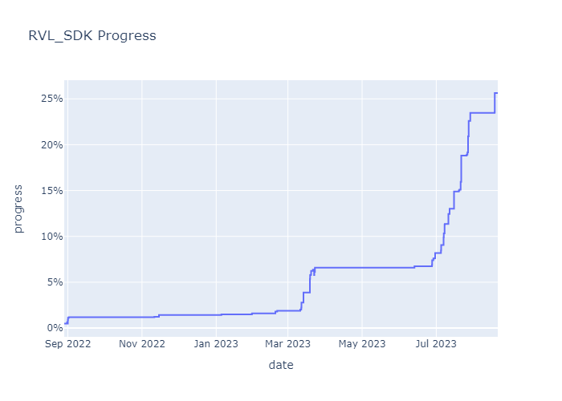

# RVL_SDK

![Badge Decompiled]

A decompilation of the Revolution SDK version used in the release of Super Mario Galaxy 1.

                    
               

[Badge Decompiled]: https://img.shields.io/endpoint?url=https://raw.githubusercontent.com/shibbo/Petari/master/libs/RVL_SDK/data/SDK.json&style=flat